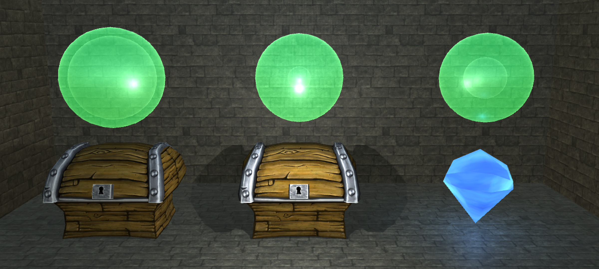

# Bandit Dungeon Demo

Simple Unity project demonstrating the multi-armed bandit algorithm. 

## Overview

In the simplest scenario, there is a single room that contains two chests. Opening a chest either yields a diamond (a good thing) or a ghost (a bad thing). Opening the same chest multiple times will yield a different sequence of diamonds and ghosts based on some underlying probability of yielding a diamond. For example, a chest that has a probability of 0.5 means that it will yield a 50-50 mix of diamonds and ghosts, while a probability of 0.9 means that it will yield a diamond nine out of every ten times, approximately. Note that each chest has its own true probability that the agent (in this case, the entity deciding which chest to open) is not aware of. Each time an agent selects a chest, they either receive a positive reward in the case of finding a diamond, or a negative reward in the case of finding a ghost. The goal of the agent is to maximize its total reward over a number of trials - in each trial the agent is allowed to select any chest. 

If the agent is aware of the true underlying probability of each chest, then its task is quite simple, all it has to do is repeatedly select the chest that has the highest probability of yielding a diamond. However, in absence of this information, the best it can do is intelligently trade off between estimating the probabilities (called exploration) and selecting the chest with the highest *estimated* probability (called exploitation). An agent that only explores will waste all its trials estimating the probability for each chest without maximizing its own reward, while an agent that performs limited exploration will waste most of its trials exploiting based on inaccurate probability estimates. The key here is how to balance exploration and exploitation effectively.

The simplest scenario of a single room that contains two chests can be expanded to include multiple rooms with several chests. In this demo you'll be able to select between a stateless bandit (one room) or a contextual bandit (three rooms). For either of those two scenarios you can choose the number of chests in each room (two through five) in addition to a few other settings discussed below.

For more information on how the agent learns a strategy for trading exploration and exploitation, check out our [corresponding post](https://blogs.unity3d.com/2017/06/26/unity-ai-themed-blog-entries/) in the [Unity AI blog](https://unity3d.ai). 

Beyond this demo, check out our [Q-learning demo](https://github.com/Unity-Technologies/Q-GridWorld) and our [Unity ML Agents repo](https://github.com/Unity-Technologies/ml-agents) which contains an SDK for applying more advanced methods to training behaviors within Unity.

## In-game Settings

The goal of this Unity project is to provide an informative visualization for the multi-arm bandit algorithm, enabling you to explore a variety of different settings.

* **Bandit Type** - Stateless bandit contains only a single set of chests. Contextual bandit contains three sets of chests, each denoted by a different room color (red, blue, and green).
* **Difficulty** - How great the difference between the optimally rewarding chest and the other chests.
* **Bandit Arms** - How many chests are in each room.
* **Begin Optimistic** - Whether to initialize the agent's value estimates with high values (active) or low values (inactive).
* **Agent Speed** - How quickly the agent takes actions. Increase speed to learn faster. Decrease speed to more easily visualize.
* **Agent Confidence** - How narrow the probability distribution over actions is. Increasing this causes the agent to more frequently pick only chests with a high estimated value. Decreasing this causes the agent to pick chests more uniformly. This essentially controls the exploration vs exploitation trade-off.

## Set-up

To get started with this project:
* [Download and install Unity](https://unity3d.com/get-unity/download) if you don't already have it. 
* Download or clone this GitHub repository.
* Open the scene.unity file under the Project/Asset subdirectory. 

Within the project:
- `Agent.cs` contains all of the multi-armed bandit logic. 
- `BanditEnvironment.cs` contains all of the environment-specific logic.
